# Coin economy rework — device verification (2026-09-09)

Hand-driven walkthrough of the single-currency coin loop on the Android
emulator (Pixel 7 AVD, debug APK, fresh database after the v14 wipe). Not a
`/ux-sweep` report — the sweep smoke for this branch lives in
[../2026-09-09-3.3-both/report.md](../2026-09-09-3.3-both/report.md).

Player: grade 2, fresh profile (streak level 0, 0 coins).

| # | Screen | What it shows |
|---|---|---|
| 1 | 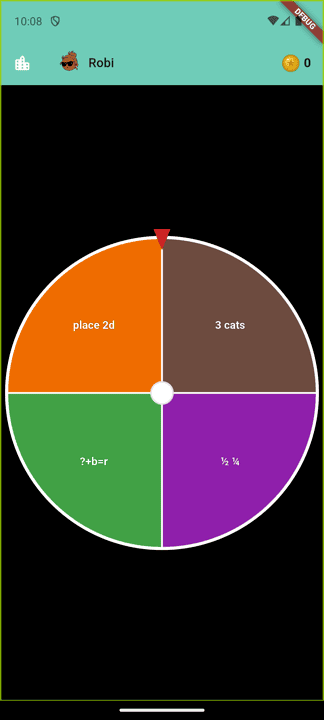 | Wheel with the painted coin counter (0). Four G1 concepts; K concepts start mastered and are off the wheel. |
| 2 | 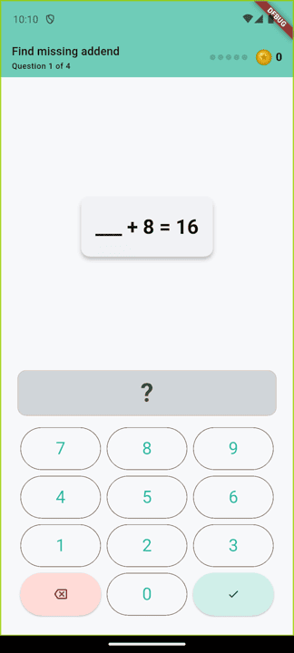 | First question of a block: "Question 1 of 4" (expectedSeconds 7 → ⌈25/7⌉ = 4), empty streak pips, coin counter. Keypad because the concept is comfortable. |
| 3 | 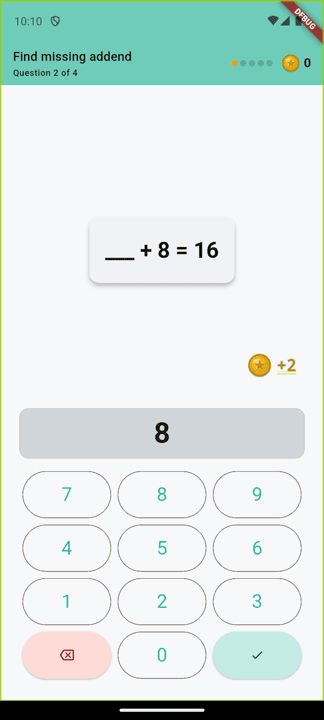 | Correct answer: the coin flies from the keypad toward the counter, which is held at 0 until it lands. `+2` = 7 s × 1.5 keypad × 0.2 (streak level 1). *(Earlier build; see row 3b for the final rendering.)* |
| 3b | 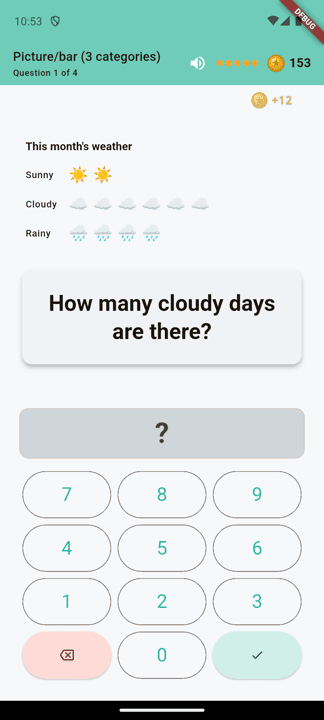 | Same moment on the final build: header stays on "Question 1 of 4" until the coin lands, no underline on the flying `+12`, counter held at 153. |
| 4 | 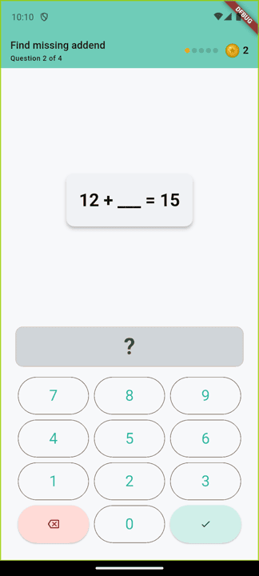 | Next question appears immediately — no green screen. Counter 2, one streak pip lit. |
| 5 | 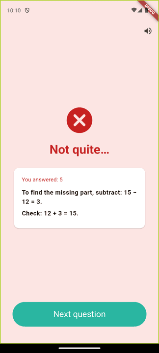 | Wrong answer mid-block: the red explanation screen stays, with "Next question" instead of "Next round". Streak resets to 0. |
| 6 | 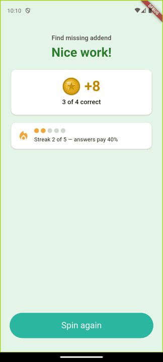 | End-of-block summary: +8 coins, 3 of 4 correct, streak 2 of 5 (answers pay 40%). |
| 7 | 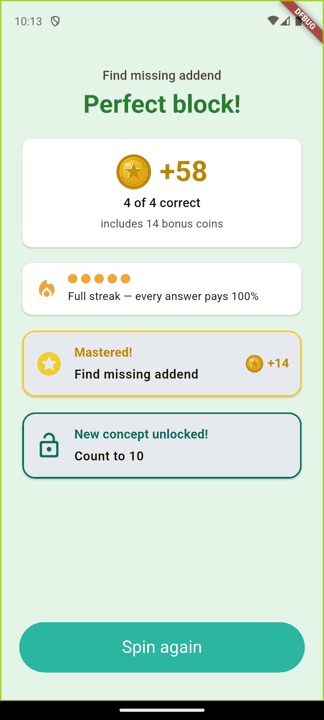 | Summary after the concept crossed into mastered: +58 including the 14-coin band bonus (2 × 7 s), full streak, the "Mastered!" card, and the drip-feed unlock card. |
| 8 | 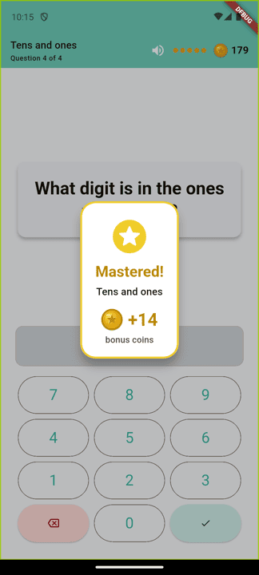 | The band-crossing celebration in place: bigger card over the question, +14 bonus. The counter (179) still excludes the bonus at this point. |
| 9 | 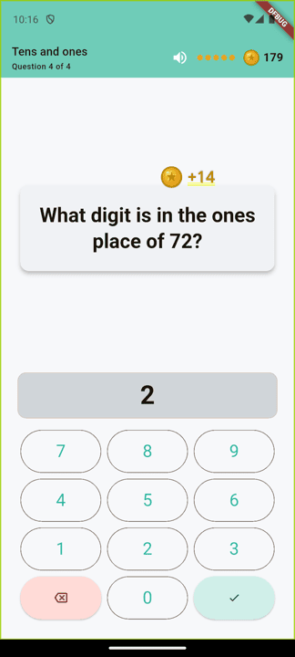 | The bonus then flies into the counter on its own. |
| 10 | 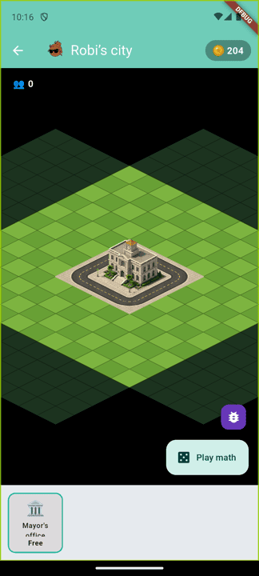 | City screen: coin-only currency bar (204 after five blocks). |
| 11 | 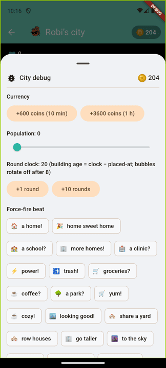 | City debug sheet: coin balance, `+600 (10 min)` / `+3600 (1 h)` grants; the research buttons are gone. |
| 12 | 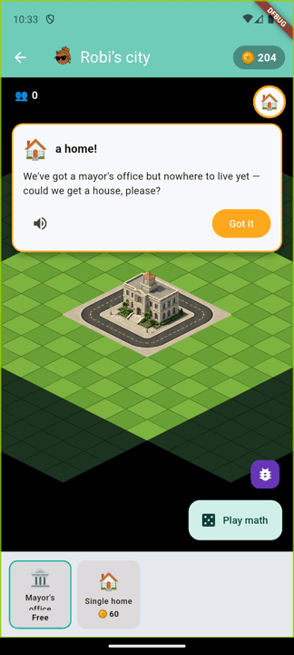 | Reading the "a home!" demand reveals *Single home · 60 coins* straight in the catalog — no locked card, no research step. |
| 13 | 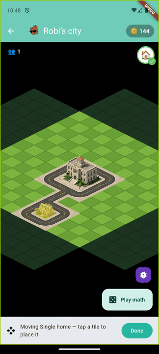 | Tap-to-place buys it instantly: 204 → 144, demand flips to ✓, population ticks. |
| 14 | 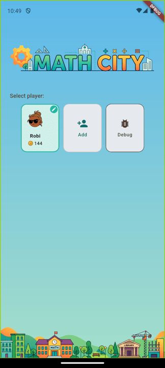 | Home player card shows the coin balance only. |

**Streak flame (2026-09-11 follow-up, replaces the pips):** the streak is one flame whose heat tracks the count, and the label is "N in a row!" — the count keeps climbing past five (pay caps there), and a fresh miss says "Start a new streak!" instead of "0 in a row". Captured after the v15 column rename migrated the existing streak (5 → 7 on the next block).

| # | Screen | What it shows |
|---|---|---|
| 15 | 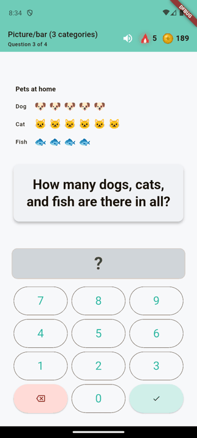 | AppBar badge at 5 in a row: red flame with side tongues and the count. |
| 16 | 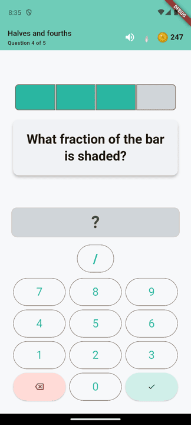 | Right after a miss: cold grey flame, no number. |
| 17 | 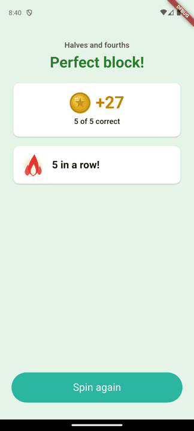 | Summary at 5 in a row: hot flame with a soft glow, "5 in a row!". |
| 18 | 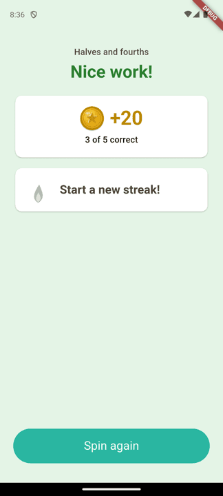 | Summary after missing the last question: "Start a new streak!". |

Not exercised on device: wheel retirement (a concept ≥2 grades below the
player at the comfortable band). A fresh grade-2 profile starts its K
concepts at p = 0.95 (mastered), so they never reach the wheel in the first
place; the rule is covered by unit tests in
`test/state/wheel_concepts_test.dart` and
`test/domain/proficiency/proficiency_band_test.dart`.
